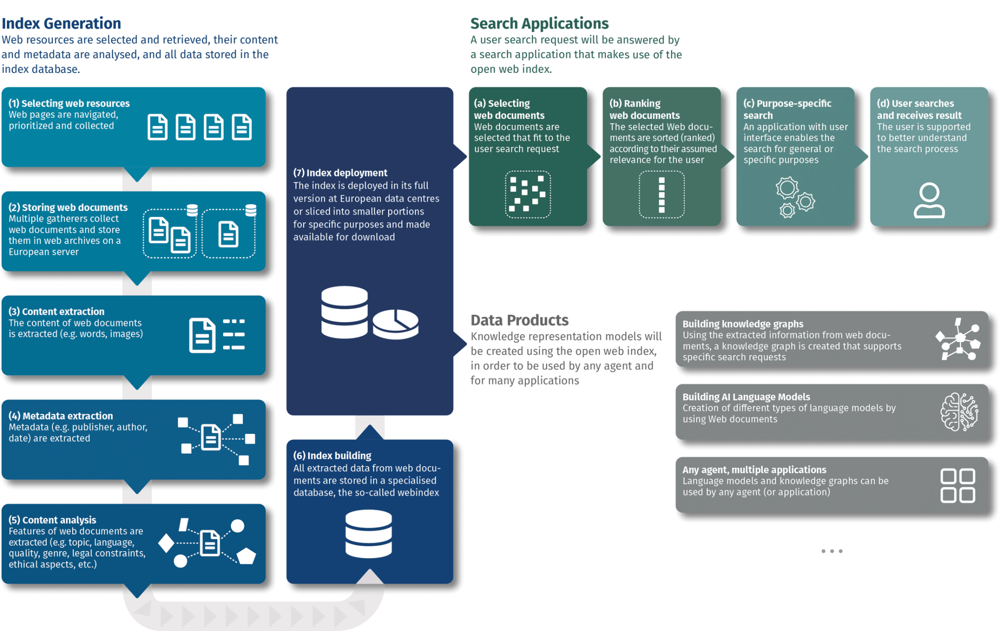

У вересні 2022 року партнери розпочали реалізацію проєкту ЄС OpenWebSearch.eu — першого проєкту, який ЄС профінансував для запуску незалежного веб-пошуку.

Проєкт виник як відповідь на занепокоєння ЕС щодо дисбалансу на ринку пошукових систем. Веб-пошук є основою цифрової економіки, але він перебуває під контролем обмеженої кількох гравців, таких як Google, Microsoft, Baidu або Yandex, які всі знаходяться за межами ЕС. Таким чином, інформація як суспільне благо, з вільним, неупередженим і прозорим доступом, більше не знаходиться під контролем европейского суспільства. Цей дисбаланс становить загрозу для демократії в межах ЕС та обмежує інноваційний потенціал дослідницького простору та економіки самого ЕС. Через це ЕС вирішив проінвестувати в розвиток незалежної, більш децентралізованої інфраструктури для пошуку в мережі Інтернет. 

<!--more-->

# Відкритий веб-індекс — поточний стан

Веб-індекс — це структура даних, яка забезпечує швидкий доступ до вмісту, сортування та фільтрацію великих веб-документів і є основою кожної сучасної пошукової системи. Зазвичай використовується інверсна індексна структура, де одиниці вмісту (наприклад, слова, метадані) вказують на список веб-документів, у яких вони зустрічаються. Якість веб-індексу залежить від якості індексованих документів, доповнених додатковими сигналами, наприклад, інформацією про використання, метаданими або структурою посилань, що дозволяє точно налаштовувати ранжування пошуку відповідно до потреб користувача. [Левандовскі запропонував ідею створити такий індекс у відкритому вигляді](https://cacm.acm.org/opinion/the-web-is-missing-an-essential-part-of-infrastructure/) через відповідну інфраструктуру. Це і стало основополагаючою базою для проекту OpenWebIndex. Однак, на відміну від Левандовскі, OpenWebIndx не маємо на мети надавати відповідний пошуковий API, а натомість хочемо надати індекс у вигляді відкритих даних, щоб інші могли використовувати його для створення пошукових систем. Поточне бачення Відкритого індексу [докладно описане в публікації в журналі JASIST](https://asistdl.onlinelibrary.wiley.com/doi/pdfdirect/10.1002/asi.24818) у 2022 році.

Схема інфраструктури OpenWebIndex зображена на рисунку нижче: ліворуч показано всі етапи створення індексу, які формують Відкритий веб-індекс як основу для пошукових застосунків (у верхньому правому куті) та дата-продуктів (у нижньому правому куті).

# Процеси в системі

## Генерація індексу

Веб-ресурси відбираються та аналізуються, і всі дані зберігаються в індексі бази даних.

1. **Відбір веб-ресурсів**
Веб-сторінки навігуються, пріоритизуються та збираються.

2. **Зберігання веб-документів**
Багато збирачів збирають веб-документи та зберігають їх у веб-архівах на європейському сервері.

3. **Вилучення контенту**
Вміст веб-документів вилучається (наприклад, слова, зображення).

4. **Вилучення метаданих**
Вилучаються метадані (наприклад, видавець, автор, дата).

5. **Аналіз контенту**
Вилучаються особливості веб-документів (наприклад, тема, мова, якість, жанр, юридичні обмеження, етичні аспекти тощо).

6. **Індексація**
Всі вилучені дані з веб-документів зберігаються в спеціалізованій базі даних, так званому веб-індексі.

7. **Розгортання індексу**
Індекс розгортається у повному розмірі в європейських центрах обробки даних або розбивається на менші частини для конкретних цілей і стає доступним для завантаження.

## Пошукові запити

Пошуковий запит буде оброблено пошуковою програмою, яка використовує відкритий веб-індекс.

а. **Відбір веб-документів**
Веб-документи, які відповідають запиту користувача, відбираються.

b. **Ранжування веб-документів**
Відібрані веб-документи ранжуються (сортуються) відповідно до їхньої релевантності для користувача.

с. **Цільовий пошук**
Додаток з інтерфейсом користувача дає змогу здійснювати пошук для загальних або конкретних цілей.

d. **Користувач здійснює пошук і отримує результат**
Користувач отримує підтримку для кращого розуміння процесу пошуку.

## Продукти даних

Моделі представлення знань будуть створені за допомогою відкритого веб-індексу, щоб використовуватися будь-яким агентом і для багатьох застосувань.

- **Побудова графа знань**
Використовуючи вилучену інформацію з веб-документів, будується граф знань, який підтримує специфічні пошукові запити.

- **Побудова моделей штучного інтелекту**
Створення різних типів мовних моделей за допомогою веб-документів.

- **Будь-які агенти, множинні застосування**
Мовні моделі та графи знань можуть використовуватися будь-яким агентом (або застосуванням).

# Програмні компоненти системи

## OWLer – Відкритий Веб-Пошуковий Краулер

Першим очевидним кроком є обхід веб-ресурсів та їх зберігання у так званих WARC (Веб-Архів) файлах. OpenWebIndex розробили краулер OWLer на основі StormCrawler, що базується на Apache Storm, та відповідно розширили його. Додаткові подробиці ви можете знайти онлайн:

- [Лендінг OWLer для вебмайстрів на домашній сторінці проекту](https://openwebsearch.eu/owler/).
- [Репозиторій з відкритим кодом на GitLab проекту](https://opencode.it4i.eu/openwebsearcheu-public/owler), що включає посилання на документацію.

## Resiliparse – Надійний та Швидкий Парсинг WARC

Зібрані дані попередньо обробляються за допомогою [бібліотеки resiliparse](https://github.com/chatnoir-eu/chatnoir-resiliparse) на базі завдання Apache Spark. Для отримання більш детальної інформації, можна ознайомитися з [документацією / вихідним кодом](https://opencode.it4i.eu/openwebsearcheu-public/preprocessing-pipeline).

## CIFF файли для обміну відкритим індексом

Далі знову запускається завдання Apache Spark для створення OpenWebIndex індексу. Проект використовує CIFF ([Common Index File Format](https://github.com/osirrc/ciff)) як стандартний формат для зберігання індексу та зробимо його доступним разом із вилученими метаданими (які зберігаються у файлах parquet). Для отримання додаткової інформації ви можете ознайомитися з наступними ресурсами:

- [Індексатор Open Web Search](https://opencode.it4i.eu/openwebsearcheu-public/spark-indexer).
- [CIFF Python Toolkit Library](https://opencode.it4i.eu/openwebsearcheu-public/ciff-toolkit/) для роботи з CIFF файлами.

## Інтеграції із іншими системи пошуку

Хоча головна увага проекту зосереджена на створенні та поширенні файлів CIFF і пов’язаних із ними метаданих, проет також розробляє інструменти для імпорту файлів CIFF у інших стандартних системи пошуку. Підтримується такі пошукові системи:

- [Apache Lucene](https://lucene.apache.org/), яка є основою для Apache Solr і Elasticsearch, може використовувати файли CIFF через [імпортер Lucene CIFF](https://github.com/informagi/lucene-ciff)
- [Pyterrier](https://github.com/terrierteam/pyterrier_pisa) підтримує CIFF "з коробки"

## Оцінювання пошукових систем

Як частина діяльності проект Open Web Search пропонує інструменти для оцінювання якості пошукових систем. Зокрема, TIREx (https://github.com/tira-io/ir-experiment-platform), створений на основі TIRA (https://github.com/tira-io/tira), дозволяє порівнювати різні пошукові пайплайни, формує рейтинги для стандартних завдань інформаційного пошуку (IR) і також підтримує імпорт CIFF.

